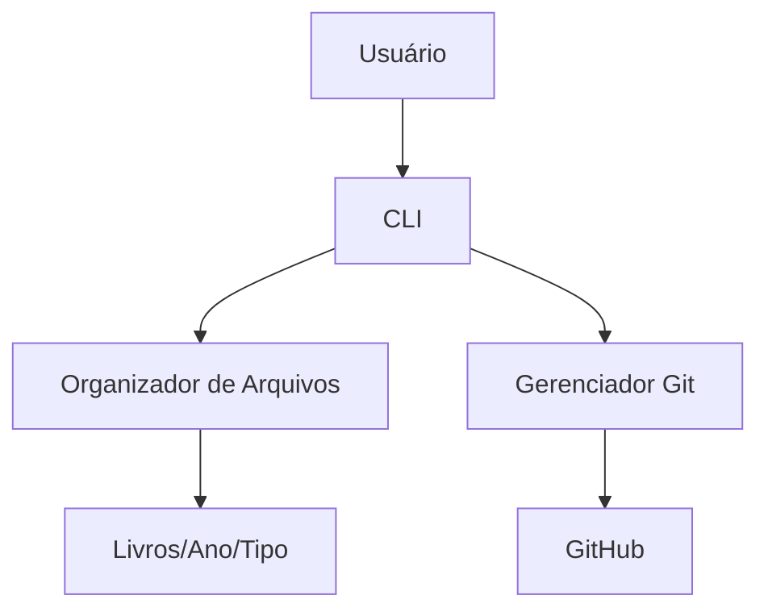

---

### Documentação do Sistema de Gestão de Bibliotecas Digitais

#### Índice

1. [Visão Geral](#1-vis%C3%A3o-geral)
2. [Instalação](#2-instala%C3%A7%C3%A3o)
3. [Guia do Usuário](#3-guia-do-usu%C3%A1rio)
4. [Arquitetura Técnica](#4-arquitetura-t%C3%A9cnica)
5. [Fluxo de Trabalho com Git](#5-fluxo-de-trabalho-com-git)
6. [Desenvolvimento](#6-desenvolvimento)
7. [FAQ](#7-faq)
8. [Playbook de Prompts](#8-playbook-de-prompts)

---

#### 1. Visão Geral

Sistema CLI para gestão automatizada de documentos digitais em bibliotecas universitárias. Principais funcionalidades:

- 🗂️ Organização automática por tipo/ano
- 📝 Interface CLI intuitiva
- 🔄 Integração com Git/GitHub
- 🛡️ Tratamento robusto de erros
- 📚 Suporte a PDF, EPUB e documentos Office

Diagrama de Arquitetura:




---

#### 2. Instalação

###### Pré-requisitos

- Python 3.8+
- Git 2.30+


###### Passo a Passo

```bash
# Clonar repositório
git clone https://github.com/CITMAX/library-super-store.git
cd library-super-store

# Instalar dependências
pip install -r requirements.txt

# Estrutura inicial
python SystemLocalLibrary.py --setup
```


---

#### 3. Guia do Usuário

###### Menu Principal

```
==================================================
    📚 SISTEMA DE GESTÃO DE BIBLIOTECA DIGITAL     
==================================================

1. Listar documentos
2. Adicionar documento
3. Renomear documento
4. Remover documento
5. Organizar arquivos
6. Sair
```


###### Comandos Essenciais

| Operação           | Comando                | Exemplo                  |
| :----------------- | :--------------------- | :----------------------- |
| Adicionar PDF      | Opção 2 → 1            | Selecione via explorador |
| Buscar Documento   | Opção 1 → Número       | 3                        |
| Sincronizar GitHub | Após qualquer operação | Commit automático        |


---

#### 4. Arquitetura Técnica

###### Estrutura de Diretórios

```
library-super-store/
├── Documentação do Projeto/
├── SystemLocalLibrary.py
├── requirements.txt
└── Livros/
    ├── PDF/
    │   └── 2024/
    ├── EPUB/
    └── Documentos/
```


###### Dependências Principais

```python
# Core
import pathlib  # Manipulação cross-platform de caminhos
from datetime import datetime  # Classificação por ano

# CLI
import tkinter.filedialog  # Diálogos de arquivo nativos

# Git
import subprocess  # Execução de comandos Git
```


---

#### 5. Fluxo de Trabalho com Git

```bash
# Commit manual
git add .
git commit -m "FEAT: Nova funcionalidade de busca"
git push origin main

# Histórico de commits
git log --pretty=format:"%h - %an, %ar : %s"
```


---

#### 6. Desenvolvimento

###### Padrões de Código

1. **Tratamento de Erros**

```python
try:
    shutil.move(arquivo, destino)
except FileNotFoundError as e:
    print(f"Erro crítico: {e}")
    logging.error(f"Falha ao mover {arquivo}: {e}")
```

2. **Documentação de Funções**

```python
def organizar_arquivos() -> None:
    """Classifica documentos por tipo e ano de criação
    
    Args:
        Nenhum
    
    Returns:
        None: Operação in-place
    
    Raises:
        OSError: Falha em operações de arquivo
    """
```


---

#### 7. FAQ

###### Problemas Comuns

**Q: Arquivo não aparece após adição**
A: Verifique permissões na pasta `Livros/` e reinicie o sistema

**Q: Erro ao sincronizar com GitHub**
A: Configure credenciais Git localmente:

```bash
git config --global user.email "usuario@biblioteca.edu"
git config --global user.name "Sistema Biblioteca"
```


---

### 
